# FOMO Firewall（Web Demo）PRD（中文）- v2（RSS-only + 处置面板 + 两层沉淀）

> 更新时间：2026-02-24  
> 目标：给 Codex/工程同学一个**完整视角**的产品定义与系统架构上下文，避免“按步骤做流水线但不知道为什么”。  
> 范围：只做 Web Demo；不做支付、不做宣传投放、不做多端。  
> **关键改动（相对 v1）：**  
> - Collect 改为 **RSS 订阅驱动**（不做手动粘贴/上传作为主路径）  
> - 日报是 **处置面板**（先打标签 FYI/DO/DROP，再决定是否进入学习对话）  
> - 沉淀改为 **两层：洞察卡（高频压缩）+ 证据包（低频追溯）**；默认保存全量对话日志；洞察卡/证据包均支持后台异步生成（手动触发）  
> - 简化：去掉 Watch；去掉任务包分流（Beginner/Advanced），只保留“问题卡/用户提问”的单一路径  

---

## 1. 背景与问题定义

在 AI 信息环境中，“垃圾但正确”的内容激增：标题制造焦虑、叙事夸张、结论看似合理但缺乏可复用价值。对熟悉行业的人容易辨别，但对多数人会触发 FOMO（Fear of Missing Out）——**不学就落后**的心理压力。

信息聚合只能让你看到更多信息，但 FOMO 的根因是：
- **意义不确定**：这条信息对我的角色/目标是否真的重要？
- **时效不确定**：必须现在处理吗？错过成本是什么？
- **行动不确定**：我该做什么才能把信息“消化”成可复用的记忆？
- **沉淀焦虑**：收藏越多越焦虑，最后变成“未读邮箱”。

因此，本产品定位不是“阅读器/聚合器”，而是：**FOMO 分诊（处置） + 行动（学习对话）闭环 + 最小沉淀（结果可复习、过程可追溯）**。

---

## 2. 产品愿景与一句话定义

### 2.1 一句话定义
**配置 RSS → 每天生成一份“处置面板”日报 → 每条线索先打标签（FYI/DO/DROP）并给出证据与理由 → 只有 DO 才进入学习对话 → 用户随时退出对话，系统默认保存全量日志 → 用户可一键异步生成洞察卡（高频复习）或证据包摘要（低频回看思维链）。**

### 2.2 产品价值主张（Web Demo 层面）
- 把“焦虑驱动的刷信息”变成“决策驱动的处置”
- 用最小学习动作减少 FOMO：**只对 DO 展开**，其余 FYI/DROP 不强迫
- 沉淀不走重型 PKM：默认沉淀为“可划卡复习”的记忆卡；需要时再打开证据包追溯思维链

---

## 3. 目标与非目标

### 3.1 目标（MVP）
1) 完整跑通闭环：**Subscribe → Digest → Triage → Learn → Deposit → (Optional) Review**
2) 每条线索输出**可解释**处置建议：一句话结论 + ≤3 条理由 + ≤2 条证据片段
3) 学习对话默认可恢复：退出不等于完成；**全量日志必保存**
4) 两层沉淀：**Insight Cards（高频）**与 **Evidence Pack（低频）**，均可异步生成
5) 支持角色差异（PM/Eng/Research）带来的“意义映射”（用于理由与解释口吻）

### 3.2 非目标（明确不做）
- 支付/订阅/商业化
- iOS/桌面端
- 复杂 RSS 管理（OPML/批量导入/高级分类）——MVP 仅支持“添加/禁用/删除”
- 复杂知识图谱/本体论（MVP 不做；未来仅做只读视图）
- 多人协作、团队空间
- 以“手动粘贴链接/上传文件”为主的深度学习场景（可作为隐藏入口/后续扩展，但不在主路径）

---

## 4. 核心概念（对用户的命名）

> **线索（Signal）**：来自 RSS 的一条内容条目（文章/快讯/视频/链接）。  
> **处置标签（L1）**：FYI（UI 文案显示为“稍后看”）/ DO（值得展开学习）/ DROP（忽略清理）。  
> **学习会话（Session）**：用户与 Agent 围绕某条 DO 线索的对话学习过程（默认保存）。  
> **洞察卡（Insight Cards）**：学习结果的一张高密度学习画布（压缩版洞察），用于快速回忆与复盘。  
> **证据包（Evidence Pack）**：对话全量日志 + 摘要 + 引用/用户证据，用于“回看思维链”。

---

## 5. 产品整体结构：四大模块（对应闭环）

### 5.1 模块 A：RSS 订阅与线索池（Subscribe / Collect）
**目标：**低成本把外部信息变成可处置的线索池。

**输入（MVP）：**
- 用户添加 RSS URL（来源/名称可选）
- 可选：给 RSS 源打标签（主题）

**输出：**
- `Signal`：包含 `source_id/title/url/published_at/summary/raw_entry`

**关键能力：**
- 定时拉取 RSS（可配置频率，MVP 可固定为每小时/每天）
- 去重（基于 url/guid/hash）
- 保存最小可追溯元数据（来源与链接必须保留）

---

### 5.2 模块 B：日报处置面板（Digest + Triage）
**目标：**让日报不是“更多阅读”，而是“更少但更可决策的处置”。

**核心产物：处置卡（Triage Card）**
要求：**结论—理由—证据—下一步**，让用户可快速采纳或改判。

最小字段（MVP 必须包含）：
1) **L1 标签**：FYI / DO / DROP  
2) **一句话结论（headline）**：例如“建议 FYI：这是转载快讯，无新增细节”  
3) **理由 reasons（≤3）**：结构化维度 + 面向用户的短句  
4) **证据片段 snippets（≤2）**：支撑理由的短摘录（<=200字）  
5) **下一步提示 next_action_hint**：DO → “进入学习对话”；FYI → “可收藏”；DROP → “清理”  
6) （可选）**score**：用于排序控量（对用户可隐藏）

**用户交互（MVP）：**
- 一键采纳或改判标签（FYI/DO/DROP）
- 展开查看证据与理由（可选）
- DO 进入学习对话

**反馈信号（记录到 EventLog，用于去重/个性化/复盘提醒）：**
- 是否改判、改判到什么
- 是否展开证据
- 是否进入会话、退出会话
- 是否请求生成洞察卡/证据包

---

### 5.3 模块 C：学习对话（Learn）
**目标：**把“我得看完”变成“我能问清楚/弄明白”。

**交互方式（单一路径）：**
- Agent 生成 3–5 个问题卡（可选）
- 用户也可以直接提问
- 对话随时可退出（退出即暂存）

**关键规则（MVP）：**
- **默认保存全量对话日志**（SessionStore），退出不等于 Completed  
- 用户可以在任意时刻重新打开会话继续聊  
- 洞察卡/证据包都不阻塞对话：作为异步任务生成

---

### 5.4 模块 D：两层沉淀（Deposit：Insight Cards + Evidence Pack）
**目标：**沉淀轻量、可复习；过程可追溯但不打扰日常。

1) **洞察卡（Insight Cards，高频）**  
- 内容：每次手动生成 1 张高密度洞察卡（价值摘要/核心洞察/关键证据/建议动作/风险边界）  
- 用途：像背单词一样划卡复习/搜索

2) **证据包（Evidence Pack，低频）**  
- 内容：对话全量日志（后台）+ 可阅读摘要 + 引用片段/用户证据  
- 用途：当用户想回顾思维链、或需要引用依据时再打开

**生成方式（MVP）：**
- 默认：系统只保存全量对话日志  
- 用户可选：点击“生成洞察卡”/“生成证据包”，两者均作为 **后台异步任务**（JobQueue）执行  
- 用户不点击也没关系：后续重新打开会话仍可生成

---

## 6. 用户旅程与关键页面（Web Demo）

### 6.1 页面 1：Sources（订阅源）
- 添加 RSS URL（名称/标签可选）
- 列表：启用/禁用/删除

### 6.2 页面 2：Digest（日报处置面板）
- 每条线索显示：标题/来源/时间/摘要（1行）  
- 处置卡摘要：L1 标签 + 一句话结论  
- 可展开：理由（≤3）+ 证据片段（≤2）
- 操作：采纳/改判 FYI/DO/DROP；DO → “进入学习对话”
- （可选）收藏：FYI 可收藏到 “稍后看”

### 6.3 页面 3：Session（学习对话页）
- 上方：线索信息（标题/来源/链接）
- 问题卡区：Agent 生成 3–5 个问题（可点选发问）
- 对话区：用户继续提问
- 退出：返回日报（自动暂存会话）
- 生成：按钮“生成洞察卡（后台）”“生成证据包（后台）”（可随时点）
- 状态：显示生成任务状态（queued/running/done）

### 6.4 页面 4：Insight Cards（记忆卡库）
- 划卡复习（下一张/翻面/标记熟悉）
- 搜索（标题/关键词/来源）
- 每张卡可跳回对应 Session / Signal

### 6.5 页面 5：Evidence Packs（证据包库）
- 列表：按日期/来源/主题
- 详情：摘要 + 引用片段 + “查看全量对话”（默认折叠）

> 说明：Review（复盘）在 v2 中降级为可选增强；若实现，可仅对 “DO 但长期未生成洞察卡/证据包” 做轻提醒。

---

## 7. 系统架构规划（Web Demo）

### 7.1 技术栈（建议）
- Next.js（App Router）+ TypeScript
- SQLite + Prisma
- RSS 拉取：服务端定时任务（Next Cron/自建 cron）
- LLM：任意 Provider（关键：**严格 JSON 输出 + 服务端校验**）
- 任务队列（MVP 可用 DB 表模拟队列；M1 再接入真正队列）
- 测试：Vitest（unit）+ Playwright（e2e）

### 7.2 分层与职责
- UI 层：Sources/Digest/Session/Memory/Evidence
- API/Server Actions：
  - rss_fetch（拉取/去重/入库）
  - digest_generate（日报控量/排序/合并）
  - triage_generate（处置卡生成 + schema 校验）
  - session_store（对话写入/恢复）
  - job_enqueue（洞察卡/证据包任务入队）
  - job_worker（异步生成洞察卡/证据包）
  - event_log（写事件）

---

## 8. 数据模型与 Schema（用于 Codex 生成代码）

> **原则：**PRD 里写全；流程图里只露出对象名与关键字段。

### 8.1 数据表（最小集合）
- `UserProfile(id, role, createdAt, updatedAt)`
- `Source(id, rssUrl, name?, tagsJson?, enabled, createdAt, updatedAt)`
- `Signal(id, sourceId, title, url, publishedAt?, summary?, rawEntryJson, createdAt)`
- `Digest(id, dateKey, signalIdsJson, createdAt)`（可选：也可按查询动态生成）
- `Triage(id, signalId, role, triageJson, createdAt)`
- `EventLog(id, userId?, signalId?, sessionId?, eventType, payloadJson?, createdAt)`
- `Session(id, signalId, role, status, createdAt, updatedAt)`
- `SessionMessage(id, sessionId, role, content, metaJson?, createdAt)`
- `Job(id, sessionId, type, status, error?, resultRefJson?, createdAt, updatedAt)`
- `InsightCard(id, sessionId, signalId, cardJson, createdAt)`
- `EvidencePack(id, sessionId, signalId, packJson, createdAt)`

---

### 8.2 Triage Card JSON Schema（MVP）
```json
{
  "label": "FYI|DO|DROP",
  "headline": "string",
  "reasons": [
    {
      "type": "source|verifiability|novelty|relevance|risk",
      "text": "string",
      "confidence": 0.0
    }
  ],
  "snippets": [
    {
      "text": "string",
      "source": "rss_summary|fetched_excerpt"
    }
  ],
  "next_action_hint": "ENTER_SESSION|BOOKMARK|DISMISS",
  "score": 0
}
```

约束：
- `reasons` 长度 1–3
- `snippets` 长度 0–2（MVP 可只用 rss_summary）
- `score` 0–100（排序控量用；可不展示）
- `headline` 必须能让用户在 2 秒内理解“为什么是这个标签”

---

### 8.3 Session（学习会话）与消息
- `Session.status`: `active|paused|closed`
- `SessionMessage.role`: `user|assistant|tool`
- **规则：**用户退出即 `paused`；再次打开恢复；默认持久化全量消息。

---

### 8.4 Job Schema（异步生成）
```json
{
  "type": "INSIGHT_CARD|EVIDENCE_PACK",
  "status": "QUEUED|RUNNING|DONE|FAILED",
  "result_ref": {}
}
```
- `INSIGHT_CARD` 输出 `InsightCard` ids  
- `EVIDENCE_PACK` 输出 `EvidencePack` id

---

### 8.5 Insight Card JSON（洞察卡）
```json
{
  "version": 1,
  "signal_title": "string",
  "value_summary": "string",
  "core_insights": ["string", "string"],
  "key_evidence": [
    {
      "text": "string",
      "from": "conversation|rss_summary"
    }
  ],
  "decision": "DO|FYI|DROP",
  "next_action": "string",
  "risk_boundary": ["string"]
}
```
约束：
- 每次手动生成 1 张洞察卡
- `core_insights` 长度 2–4
- `key_evidence` 长度 1–3
- `risk_boundary` 长度 1–2

---

### 8.6 Evidence Pack JSON（证据包）
```json
{
  "summary": "string",
  "key_quotes": [
    {
      "text": "string",
      "from": "rss|conversation"
    }
  ],
  "links": ["string"],
  "trace": {
    "signal_id": "string",
    "session_id": "string"
  }
}
```
说明：
- 全量对话不放在 packJson 里（避免膨胀），而是通过 `SessionMessage` 回溯
- packJson 提供“可读摘要 + 关键引用 + 链接”

---

## 9. 核心业务规则（必须明确）

### 9.1 日报控量与去重（防止日报变邮箱）
- 同一 `signal.url/guid` 只入一次
- 每日日报控制上限 N（默认 20，可配置）
- 优先展示 `score` 高、或来源更可信的线索

### 9.2 处置卡可解释性（反黑箱）
- 必须输出 `headline`
- `reasons` ≤3，且每条理由必须有对应 `snippets` 或“来源类型”支撑（弱证据也要说明是推断）
- UI 允许用户一键改判，改判写入 EventLog

### 9.3 默认保存（关键）
- 进入 Session 后，所有对话消息默认持久化
- 用户退出不触发任何“完成”语义，只是 `paused`

### 9.4 异步生成（不阻塞）
- 生成洞察卡/证据包必须走 JobQueue
- Job 状态可见（queued/running/done/failed）
- 用户离开 Session 后 Job 仍可继续

---

## 10. 核心 API（建议形态）
1) `POST /api/sources`：添加 RSS  
2) `POST /api/sources/:id/toggle`：启用/禁用  
3) `POST /api/jobs/rss_fetch`：拉取 RSS（cron 调用）  
4) `POST /api/digest/:date/generate`：生成日报（cron 或用户打开触发）  
5) `POST /api/signals/:id/triage`：生成处置卡（prefetch）  
6) `POST /api/signals/:id/disposition`：用户采纳/改判（写 EventLog）  
7) `POST /api/sessions`：创建/恢复会话  
8) `POST /api/sessions/:id/messages`：写入消息  
9) `POST /api/sessions/:id/jobs`：请求生成 INSIGHT_CARD/EVIDENCE_PACK（入队）  
10) `GET /api/insight_cards` / `GET /api/evidence_packs`

---

## 11. MVP 验收标准（Demo 是否成立）
1) **端到端闭环**：RSS → Digest → Triage → Session → 退出保存 → 后台生成洞察卡 → Insight Cards 可复习  
2) **处置面板可理解**：每条线索有 L1 标签 + headline + ≤3 reasons + ≤2 snippets  
3) **不强迫学习**：FYI/DROP 不进入 Session；DO 才进入  
4) **默认可恢复**：用户退出后再次打开同一线索会话可继续  
5) **异步不阻塞**：点击生成后可立即回到日报继续下一条；生成完成后库中可见

---

## 12. 事件类型枚举（建议）
- `DISPOSITION_ACCEPTED`
- `DISPOSITION_OVERRIDDEN`
- `OPEN_EVIDENCE`
- `ENTER_SESSION`
- `EXIT_SESSION`
- `SESSION_RESUME`
- `JOB_REQUESTED_INSIGHT_CARD`
- `JOB_REQUESTED_EVIDENCE_PACK`
- `JOB_DONE_INSIGHT_CARD`
- `JOB_DONE_EVIDENCE_PACK`
- `CARD_REVIEWED`
- `CARD_STARRED`

---

## 13. 业务流程图（v2）

```mermaid
flowchart TD
  A[用户配置 RSS 源] --> B[系统定时拉取 Feed]
  B --> C[解析条目/去重/入线索池 Signals]

  C --> D["Agent Async&#47;Batch 生成日报 Digest<br/>控量筛选&#47;去重合并&#47;排序"]
  D --> E[日报处置面板<br/>每条=一条线索]

  %% Triage card must be: conclusion-reasons-next
  E --> F["[Agent Async/Prefetch] 生成处置卡 TriageCard<br/>L1: FYI / Do / Drop<br/>+ 一句话结论<br/>+ Reasons≤3 + Snippets≤2<br/>+ 建议下一步"]
  F --> G{用户采纳标签?}
  G -->|改判| H[用户选择 FYI/Do/Drop]
  G -->|采纳| I[使用 Agent 标签]

  %% Log
  H --> J[记录处置结果/反馈信号]
  I --> J
  J --> DB[(DB: EventLog<br/>user_id, signal_id, event_type, payload, ts)]

  %% Branch by label (no Watch)
  J --> K{L1 标签}
  K -->|Drop| K1[忽略清理]
  K -->|FYI| K2[可选：收藏到「稍后看」]
  K -->|Do| L[进入学习对话 Session]

  %% Session: default save full logs
  L --> S0[创建/恢复 Session<br/>默认保存全量对话日志]
  S0 --> SDB[("DB: SessionStore<br/>session_id, signal_id, messages[], status")]
  
  %% Learning chat
  S0 --> M["[Agent Sync] 生成问题卡(3-5个)<br/>或用户直接提问"]
  M --> N[与 Agent 对话学习]
  N --> O{用户退出对话?}
  O -->|继续| N
  O -->|退出| P[结束/暂存 Session<br/>返回日报继续处置]

  %% Optional async generation (user-triggered)
  O --> Q1[用户点击：生成洞察卡] 
  O --> Q2[用户点击：生成证据包摘要]

  Q1 --> J1[("JobQueue: enqueue insight_card_job")]
  Q2 --> J2[("JobQueue: enqueue evidence_job")]

  J1 --> R1["[Agent Async] 生成洞察卡(1张高密度画布)"]
  R1 --> MC[(Insight Cards 库<br/>高频：划卡复习/搜索)]

  J2 --> R2["[Agent Async] 生成证据包摘要<br/>对话全量日志已在 SessionStore"]
  R2 --> EP[(Evidence Pack 库<br/>低频：回看思维链/依据)]
```


---

# 附录：对 v1 的迁移建议（可选）
- 若保留 v1“手动粘贴链接”能力：可作为 `Source.type=manual` 或 “新建单条 Signal” 隐藏入口，不进入主路径与主叙事。
